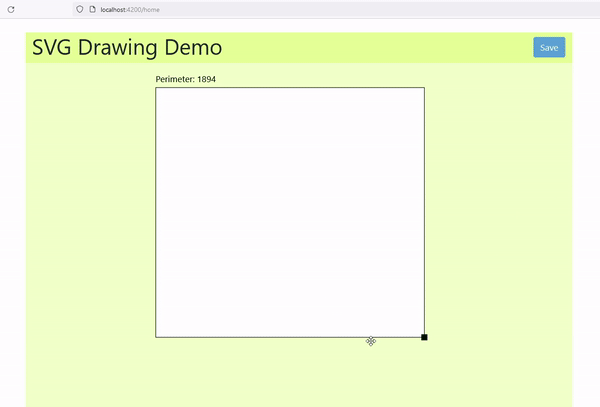

# Welcome to the SVR draw and save project

This is a demo project for drawing an SVG figure in a web app and saving it in the cloud.
As a demo, a rectangle shape can be drawn and saved.<br/><br/>


## Technology stack

This repository is built on top of Angular and Asp .NET Core however in the implementation detail, we will find other supporting technologies as well.

#### Client side

- [Angular] - A JavaScript framework for building user interfaces
- [RxJS] - Reactive extensions library for JavaScript

#### Server side

- [ASP.NET Core] - A cross-platform, high-performance, open-source framework for building modern, cloud-enabled, Internet-connected apps

## Features

- The initial dimensions of the SVG figure are taken from a JSON file.
- The user can resize the figure by mouse.
- Near the figure, the perimeter of the figure is shown.
- After resizing, the system updates the JSON file with new dimensions.

## Parts

Following are the parts of the project.

#### End client web application
This is the end client part of the project. This is a single-page web app.<br/>
Layer: Frontend (Web SPA)<br/>
Primary Technology: Angular<br/>
Folder: svg-draw-client

#### API server application
This is the API server part of the project. This is a web API app.<br/>
Layer: Backend (API Server)<br/>
Primary Technology: Asp .NET Core<br/>
Folder: svg-draw-server

## Running the application
The description to run the project locally(development mode) is given below.

### Frontend 

#### Prerequisites

- Node.js : To run npm packages (Tested with version v16.13.2)
- IDE : Visual Studio Code

##### Steps

- To run the client project we should install npm packages first and also make sure the server project is up and running.
- Command to install NPM packages and start the localhost server is given below.

#### Terminal commands

```sh
cd svg-draw-client
npm i
npm start
```

#### Alpha Testing
Open the link http://localhost:4200/ in any browser and use the app as described in the "User Guide" below.

### Backend

#### Prerequisites

- DOT NET Framework : to provide a run-time execution environment that manages ASP .NET Core app (Tested with v4.8)
- IDE : Visual Studio

##### Steps

- Open the SvgDrawServer.sln file with Visual Studio.
- Run the project.
- Start the API server with SSL certificate. (Certificate is provided by the IDE while running in localhost)

#### Alpha Testing
Perform GET and POST operation using the end point https://localhost:7331/api/rectangle in Postman.<br/>
After successful GET operation the parameters of the rectangle will be available in the response in JSON format.<br/>
After successful POST operation the provided parameters will be saved in the JSON file.

## Data Source
The dimensions of the figure are saved in a JSON file. The initial parameters are added to the file. After resizing and saving the updated parameters will be saved in the same file.<br/>
The file is saved in the API server.<br/>
Location: svg-draw-server/SvgDrawServer/Data/rectangle-data.json<br/>

Sample content:
```sh
{
  "id": 102,
  "name": "sampleName",
  "originX": 100,
  "originY": 100,
  "width": 100,
  "height": 100,
  "strokeColor": "black",
  "fillColor": "white",
  "strokeWidth": 1
}
```
After resizing following four parameters will be changed.

- originX: left top conner x position of the rectangle in the screen
- originY: left top conner y position of the rectangle in the screen
- width: width of the rectangle
- height: height of the rectangle

## User Guide
- After opening the web page the rectangle will be shown with its initial dimensions.
- Drag the figure by clicking inside the figure and dragging by mouse.
- Resize the figure by clicking and dragging the marker on the bottom right corner of the figure by mouse.
- Save the figure by clicking the save button.

## License

This project is [MIT licensed](https://github.com/Saeed1989/angular-svg-draw-save/blob/main/LICENSE)

[Angular]: https://angular.io/
[RxJS]: https://rxjs.dev/
[ASP.NET Core]: https://docs.microsoft.com/en-us/aspnet/core/introduction-to-aspnet-core?view=aspnetcore-6.0
